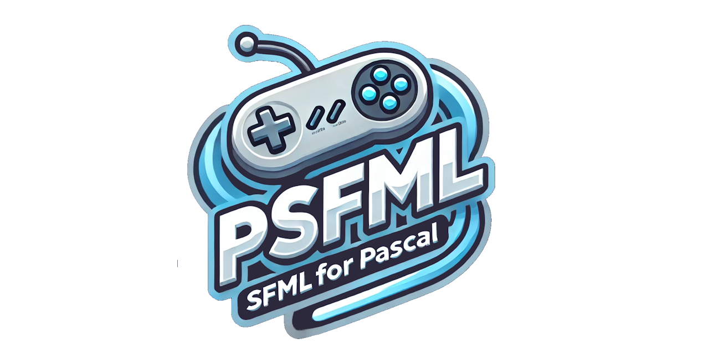

  

[](https://discord.gg/tPWjMwK)
[](https://bsky.app/profile/tinybiggames.com)

**PSFML** is a Pascal binding for the **⚡ Simple and Fast Multimedia Library (SFML)**, providing Pascal developers with a straightforward way to utilize SFML’s multimedia features directly in their projects. Whether building 🎮 games, 🤖 interactive applications, or 🎥 multimedia tools, PSFML integrates smoothly with SFML, bringing robust multimedia functionality to the Pascal ecosystem.

## 📋 Table of Contents
- [📖 Introduction](#introduction)
- [✨ Features](#features)
- [🚀 Getting Started](#getting-started)
  - [📌 Requirements](#requirements)
  - [⚙️ Installation](#installation)
- [📐 Usage](#usage)
  - [💡 Basic Example](#basic-example)
- [🛠️ Extensions](#extensions)
  - [🗜️ ZipFile Support](#zipfile-support)
  - [📼 MPEG-1 Video Playback](#mpeg-1-video-playback)
  - [📄 Enhanced InputStream](#enhanced-inputstream)
- [🤝 Contributing](#contributing)
- [📄 License](#license)
- [🆘 Support](#support)

## Introduction

PSFML leverages the power of **SFML** and makes it accessible to Pascal programmers. With PSFML, you can create 🪟 windowed applications, manage 🖼️ graphics, handle real-time user input 🎮, play 🔊 audio, and even stream 📹 video. PSFML is built specifically to work on **💻 Windows** (Windows 10 and higher) and is fully compatible with [Delphi](https://www.embarcadero.com/products/delphi).

### Why PSFML?

- **📝 Pascal-Focused**: PSFML is designed explicitly for Pascal developers, offering a familiar and intuitive API that fits naturally into existing Pascal workflows.
- **📦 Minimal Distribution Overhead**: All library dependencies are embedded within the executable, ensuring a streamlined deployment process that eliminates external dependencies and minimizes potential compatibility issues.
- **🛠️ Modern Compiler Support**: PSFML is compatible with **Delphi Community Edition** and higher, enabling seamless integration for Delphi developers targeting **Windows 64-bit**. PSFML has been rigorously tested on **Windows 11 24H2**, ensuring stability and performance for professional-grade applications. 
- **🆕 Up-to-Date with SFML**: Always kept in sync with the latest **SFML** version, ensuring access to all the latest features and fixes.

## Features

- **🔑 Core SFML Integration**: Full access to SFML’s core features for Pascal developers, including 🪟 window management, 🖼️ rendering, 🎮 input handling, 🔊 audio playback, and 🌐 network communication.
- **🛠️ Extension Support**: Includes several valuable extensions that add capabilities beyond the base SFML functionality.
  - **🗜️ ZipFile Support**: Standard compression and encryption to manage archived resources like assets or save data seamlessly.
  - **📼 MPEG-1 Video Playback**: Support for video playback, useful for creating 🎮 game cutscenes or multimedia features.
  - **📄 Enhanced InputStream**: Built to work with **ZipFile** and other input sources, providing flexible options for handling data streams.
  - **📏 High-DPI Awareness**: Automatically adjusts the rendering window size based on the desktop DPI value to maintain consistent visual quality on different displays.
  - **🔮 Future Extensions**: Additional features will be added in future updates, enhancing the library's utility.
- **⚡ Optimized for Windows**: Developed with a focus on **Windows 11** using **Delphi 12.2** to provide a stable, performant foundation for 🎮 game and multimedia applications.

## Getting Started

### Requirements

- **Delphi CE** or a higher edition for development.
- **💻 Windows 10** or higher (64-bit).

### Installation

1. 📥 Download the latest version of [PSFML](https://github.com/tinyBigGAMES/PSFML/archive/refs/heads/main.zip).
2. 📂 Extract the contents to your project directory.
3. ➕ Add the **PSFML** `src` folder to your **Library Path** in Delphi.
4. 📝 In your project, include `PSFML` in the `uses` clause. To leverage the extensions, add `PSFML.Ext` after `PSFML` in the `uses` clause.
5. 📁 Refer to the `examples` folder for detailed usage instructions and demonstrations of the PSFML library in action.
6. ▶️ It is recommended to run the `ZipFile01` example initially to generate the `data.zip` file required by other examples.

## Usage

### Basic Example

Below is a simple example of how to create a 🪟 window and handle real-time user input 🎮 using **PSFML**:

```pascal
uses
  System.SysUtils,
  PSFML,     // core SFML
  PSFML.Ext; // extensions; must always come AFTER PSFML

var
  LWindow: PsfRenderWindow;
  LEvent: sfEvent;
  LFont: array[0..0] of PsfFont;
  LText: array[0..0] of PsfText;
  LHudPos: sfVector2f;
begin
  LWindow := sfRenderWindow_create('PSFML: RenderWindow #01');

  LFont[0] := sfFont_CreateDefaultFont();
  sfFont_SetSmooth(LFont[0], True);

  LText[0] := sfText_Create(LFont[0]);
  sfText_SetCharacterSize(LWindow, LText[0], 12);

  sfRenderWindow_clear(LWindow, BLACK);
  sfRenderWindow_clearFrame(LWindow, DARKSLATEBROWN);

  while sfRenderWindow_isOpen(LWindow) do
  begin
    while sfRenderWindow_pollEvent(LWindow, @LEvent) do
    begin
      case LEvent.&type of
        sfEvtClosed:
          sfRenderWindow_close(LWindow);

        sfEvtResized:
          sfRenderWindow_resizeFrame(LWindow, LEvent.size.width, LEvent.size.height);

        sfEvtKeyReleased:
          if LEvent.key.code = sfKeyEscape then
            sfRenderWindow_close(LWindow);
      end;
    end;

    sfRenderWindow_startFrame(LWindow);

    sfRenderWindow_drawFilledRect(LWindow, LWindow.Size.x - 50, 0, 50, 50, RED);

    LHudPos := sfVector2f_Create(3, 3);
    sfRenderWindow_DrawTextVarY(LWindow, LText[0], LHudPos.x, LHudPos.y, WHITE,
      '%d fps', [sfRenderWindow_GetFrameRate(LWindow)]);
    sfRenderWindow_DrawTextVarY(LWindow, LText[0], LHudPos.x, LHudPos.y, DARKGREEN,
      'ESC - Quit', []);

    sfRenderWindow_endFrame(LWindow);
    sfRenderWindow_display(LWindow);
  end;

  sfText_Destroy(LText[0]);
  sfFont_Destroy(LFont[0]);
  sfRenderWindow_destroy(LWindow);
end.
```

This example demonstrates basic 🪟 window creation, event polling, and drawing 📝 text, providing a starting point for any real-time application.

## Extensions

### ZipFile Support

PSFML includes integrated support for working with compressed and encrypted zip files using **ZipFile**. This extension allows you to load resources like 🖼️ textures, 🔊 sounds, and other data directly from a zip archive.

### MPEG-1 Video Playback

The video playback extension allows for **MPEG-1** video file streaming, ideal for in-game cutscenes or multimedia presentations.

### Enhanced InputStream

The **Enhanced InputStream** offers improved capabilities for streaming files, especially when used in conjunction with **ZipFile**, making it easier to work with archived content.

## Contributing

Contributions to **PSFML** are highly encouraged. If you'd like to contribute to the project, please submit issues or pull requests on our [GitHub repository](https://github.com/tinyBigGAMES/PSFML).

<a href="https://github.com/tinyBigGAMES/PSFML/graphs/contributors">
  
</a>

## License

**PSFML** is distributed under the **BSD-3-Clause License**, allowing for redistribution and use in both source and binary forms, with or without modification, under specific conditions. See the [LICENSE](https://github.com/tinyBigGAMES/PSFML?tab=BSD-3-Clause-1-ov-file#BSD-3-Clause-1-ov-file) file for more details.

## Support

- [🐛 Issues](https://github.com/tinyBigGAMES/PSFML/issues)
- [💬 Discussions](https://github.com/tinyBigGAMES/PSFML/discussions)
- [🌐 SFML Website](https://www.sfml-dev.org/)
- [📺 SFML on YouTube](https://www.youtube.com/results?search_query=SFML&sp=CAI%253D)

<p align="center">
  
</p>
<h5 align="center">Made with ❤️ in Delphi</h5>
